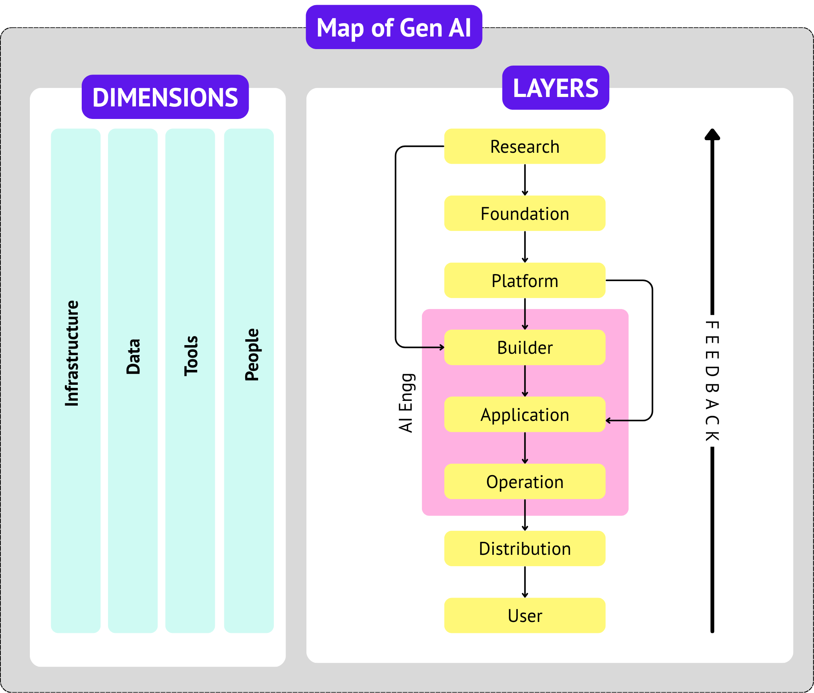

# 🗺️ Map of Generative AI

> Source: https://youtu.be/WzvURhaDZqI?si=3IMnGmFobOb-OBkH

---

All the content belonging to my dear Nitish sir channel 💜 [CampusX](https://www.youtube.com/@campusx-official)

---
**About Me**
I’m Rudra Prasad Bhuyan, a self-taught data science student guided by my mentor, Nitish sir. (From YT)

<!-- Social Media Links-->

  
  
  

<!-- Two Master Repo Links -->

  
  

